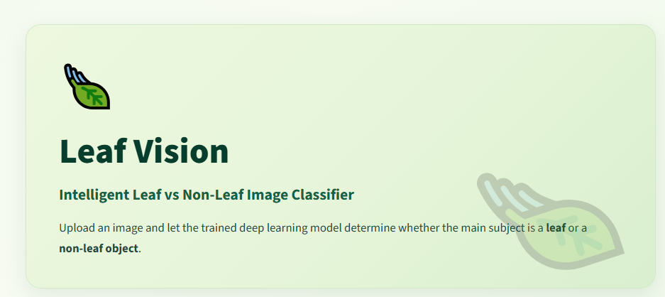
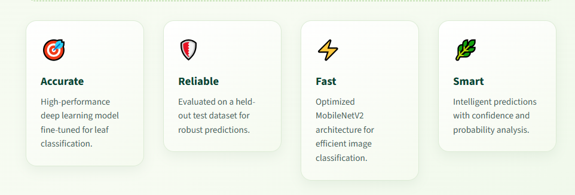

# 🍃 Leaf Vision — Leaf vs Non-Leaf Image Classification

### Intelligent Binary Image Classification with MobileNetV2

Leaf Vision is an end-to-end deep learning project that classifies images as either **leaf** or **non-leaf**.

The project covers the complete machine learning lifecycle: dataset inspection, cleaning, duplicate removal, preprocessing, transfer learning, fine-tuning, independent evaluation, model verification, and deployment as an interactive Streamlit web application.

---

## 🖥️ Application Preview

<p align="center">
  
</p>

<p align="center">
  <em>Leaf Vision — deployed image classification application</em>
</p>

<p align="center">
  
</p>

<p align="center">
  <em>Accurate, reliable, fast, and intelligent image classification</em>
</p>

---

## 🚀 Live Demo

Try the deployed application:

**https://leaf-vision.streamlit.app**

Upload an image and receive a leaf/non-leaf prediction with confidence information.

---

## 📌 Project Overview

This project develops a binary image classification system capable of distinguishing between:

- 🌿 **Leaf**
- 🚫 **Non-Leaf**

The model uses **MobileNetV2 Transfer Learning**, followed by targeted fine-tuning to improve classification performance.

The goal was not simply to train a model, but to develop a complete and deployable machine learning solution.

---

## 🎯 Objectives

The project aims to:

1. Inspect and understand the raw dataset.
2. Clean and filter unsuitable data.
3. Organize images into two classes.
4. Detect and remove duplicate images.
5. Create training, validation, and independent test sets.
6. Build a MobileNetV2-based classifier.
7. Establish a strong baseline model.
8. Fine-tune the pretrained model.
9. Evaluate performance using an independent test set.
10. Verify the final deployment model.
11. Deploy the model as a web application.

---

## 📊 Results at a Glance

| Metric | Result |
|---|---:|
| Classification type | Binary |
| Classes | 2 |
| Cleaned images | **5,386** |
| Leaf images | **4,389** |
| Non-leaf images | **997** |
| Independent test images | **541** |
| Initial test accuracy | **98.89%** |
| Final test accuracy | **99.82%** |
| Final correct predictions | **540 / 541** |
| Final incorrect predictions | **1 / 541** |
| Model | **MobileNetV2 + Fine-tuning** |
| Deployment | **Streamlit Community Cloud** |

---

## 🧠 Machine Learning Approach

### Why MobileNetV2?

MobileNetV2 was selected because it provides a practical balance between:

- Classification performance
- Computational efficiency
- Model size
- Inference speed
- Deployment suitability

### Model Pipeline

```text
Input Image
     ↓
RGB Conversion
     ↓
Resize to 224 × 224
     ↓
Normalize Pixel Values
     ↓
MobileNetV2
     ↓
Global Average Pooling
     ↓
Dropout (0.30)
     ↓
Dense (1)
     ↓
Sigmoid
     ↓
Leaf / Non-Leaf